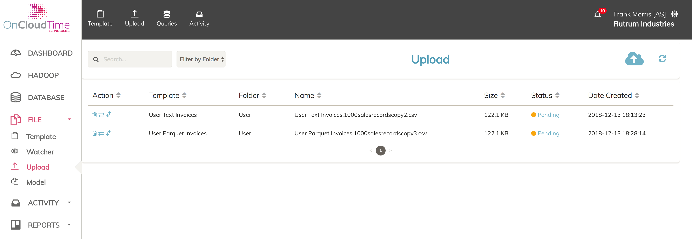
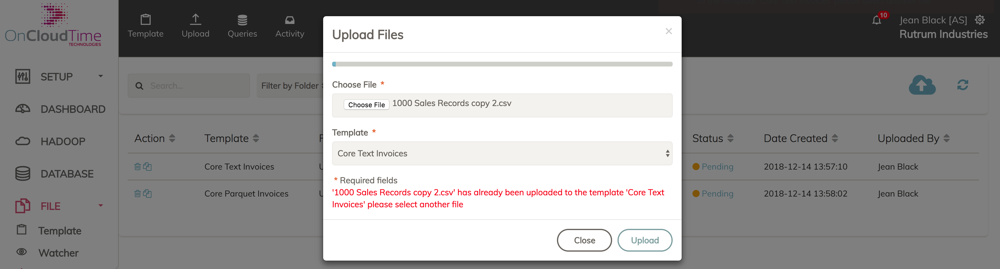
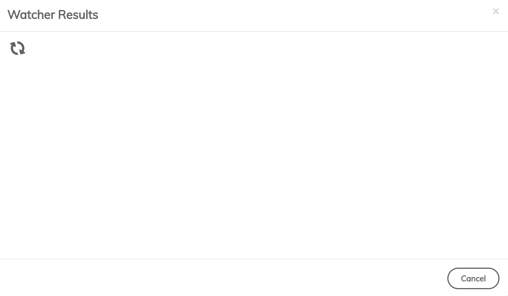
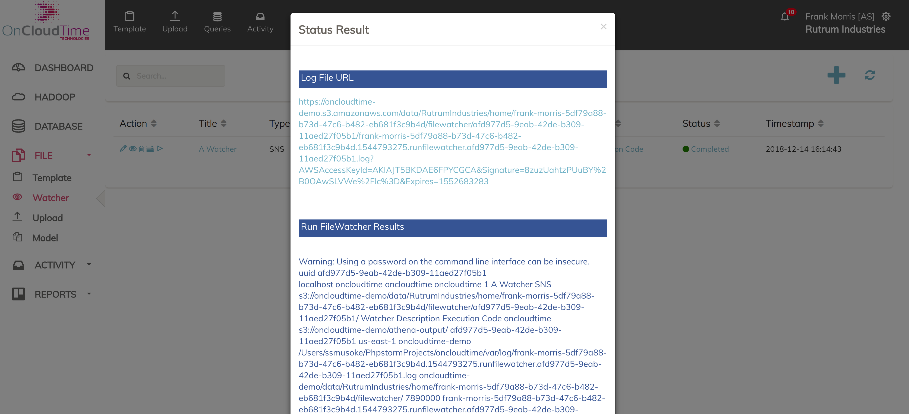

# User Features and Workflows 
This section illustrates the different aspects of the applicaiton using the following sample information: 
* S3 Bucket: oncloudtime-demo
* Account: Rutrum Industries 
* Super User: System Admin
* Account Admin: Jean Black (username: jean-black-6eb865f7-d5d6-4f04-bf6d-4a0ee05a8081)
* User: Frank Morris (username: frank-morris-5df79a88-b73d-47c6-b482-eb681f3c9b4d)

## Deployment Options 
The following deployment options are available: 
1. Agency - has access to the Super User role and can create multiple distinct accounts whose data is maintained independently. The Super User can access and manage the data across all accounts 
2. Company - only has access to the company's account created by a Super User 
3. AWS Marketplace - coming soon 

## Directory Structure 
This section describes the directory structure on how data is stored which is illustrated in the image below:

**NOTES**
1. The root folders at the bucket level are `data` and `trash`
2. The `trash` folder contains a mirror of any content deleted from `data`
3. Each account has its own folder i.e, `RutrumIndustries, AcmeCorp, AccountFolder`
4. Under each account folder is a `home` folder cotaining user specific data, and a `shared` folder containing resources that are accessible by all users within the account 
5. The user folder is of the form` firstname-lastname-uuid` for uniqueness 
6. Each module within the application has a folder under the user folder, and in the shared folder if resource sharing is needed 

## Notifications 
1. For each action that is carried out, a notification popup is displayed both at the start of the action and at the end of the action in the top right hand corner. The colro coding for the notifications are:
    - Action Start: Blue  
    - Successful Completion: Green 
    - Error occurs during exection: Red
2. The last 10 notifications are always displayed on the bell icon just before the user's name which can be displayed by clicking on it as displayed below 

3. The red number is the count of unread notifications by the user 
3. If a notifcation is selected in the drop-down from the bell icon, the counter is reduced by 1 since it only displays the unread notifications and the notification is tagged with an open enveloped as displayed below 

## Command Logging
All command execution information is logged into an SQS Queue which is defined at the installation stage before using the application 
## Setup and Application Configuration
These are found under the Setup menu and are visible only to users with the `ROLE_ADMIN` and `ROLE_SUPER_ADMIN`
## Reset Data 
An administrator can reset the data in an account which deletes all defined data while maintaining the user accounts

1. Click the `Reset Data` link under the `Setup Menu`

2. Click `Yes` in the confirmation popup

3. A progress indicator runs until the reset process is completed 

4. The logs from the reset activity are displayed 

# User and Account Management
## User Roles 
Access to the different features within the application depend on the roles that the user has access to. A complete list of roles is below: 
1. ROLE_SUPER_ADMIN 
2. ROLE_ADMIN 
3. ROLE_CONVERSIONS
4. ROLE_DATABASE
5. ROLE_DELETE_SHARED_DATA
6. ROLE_DELETE_USER_DATA
7. ROLE_FILE_UPLOAD
8. ROLE_FILE_WATCHER
9. ROLE_HADOOP
10. ROLE_MODEL
11. ROLE_QUERIES
12. ROLE_RECOVER_SHARED_DATA
13. ROLE_RECOVER_USER_DATA
14. ROLE_SIMULATION
15. ROLE_TABLES
16. ROLE_TEMPLATE
17. ROLE_USER

## Hierarchy of User Roles 
The hierarchy of user accounts is based on the roles that the accounts have in order to access advanced features:
1. ROLE_SUPER_ADMIN - can create new accounts and users. Only accessible in Agency and AWS Marketplace deployments 
2. ROLE_ADMIN - has access to administrative actions on an account plus access to data for all users in the account within the account
3. ROLE_USER - has access to resources they create in an account and any shared resources by the account admin

## User Access Restrictions

1. Each user is tied to one account 
2. A user can only see their data and any shared data by the account administrator 
3. An account administrator can see the data for all the users in the account, copy files into shared folders 

## Login and Access Control
1. Each user requires an email address and password to access the application
2. A user can only access their own data and shared data within the account to which they are associated  
3. A user can only access features depending on the roles assigned to them by the account administrator 
## Account Management 
This is done by a user with the `ROLE_SUPER_ADMIN`

1. The minimum information needed is: 
   * Name 
   * Description   
   * admin account email address and password 
   * Links to information displayed on the dashboard, current and historical activity pages 
2. When an account is created the following happens:
   * folder with account name is created in S3 at the path `s3://oncloudtime-demo/data/RutrumIndustries/` 
   * The administrator account is created 
   * An SNS topic is created for the account to which all account users are subscribed.  

## User Management 

This is done  by the account administrator

1. The minimum information required for this is: 
  * First Name 
  * Last Name 
  * Email address (cannot be duplicated)
  * Roles granting access to different features within the application 
2. When an account is created the following happens: 
  * A folder in the account directory, is created at the following path `s3://oncloudtime-demo/data/RutrumIndustries/home/firstname-lastname-uuid`
  * An SNS topic is created for the user to receive notifications 
  * The user email address is subscribed to both the application and account SNS topics  

## Change User Password 
1. Click the Settings (gear icon) just after the user name 
2. Select My Profile 
3. Click the `Change Password` button
4. Enter the old password, and the new password then click `Submit`

## Update user profile information 
1. Click the Settings (gear icon) just after the user name 
2. Select My Profile 
3. Click the `Edit Profile` button
4. Update the profile then click `Submit`

# Dashboard

Displays data specified by a link in the account configuration. The default display is shown below:

The link can be changed within the account configuration

# Hadoop
A user can create and run Hadoop configurations.
## Create a new Hadoop Configuration 
1. Click the Hadoop or + (in the right hand side) to open a popup window 

2. Enter the Hadoop configuration information - number of nodes and category 

3. As the configuration is being created (which may take some seconds) the `Create` button is disabled 

4. A new configuration is created with the status `Created`

## Start a Hadoop Configuration 
1. Click the arrow next to the instance to be started, and a notification will be displayed as below 

2. When the hadoop instance startup is completed, the status changes to `Started` and notification is diplayed as below

## Stop a Hadoop Configuration 
1. Click the box next to the instance to be started, and a prompt to stop the Hadoop instance will appear as below. Click Yes to continue  

2. When the hadoop instance instance is stopped is completed, the status changes to `Stopped` as below

# Database

A user can create and run MPP database configurations

# File Management
The file managment features allow the definition of metadata to manage and query files for data 

The sample templates that will be used in this section will be the following:
- Core Text Invoices (format Text and type Core)
- User Text Invoices (format Text and type User)
- Core ORC Invoices (format ORC and type Core)
- User ORC Invoices (format ORC and type User)
- Core Parquet Invoices (format Parquet and type Core)
- User Parquet Invoices (format Parquet and type User)

## Templates
Templates are used to store metadata for processing of files

### Create User Text Template
A user template is created by a user or an administrator and it is not available for other users. 

The steps for creating a user template for Text format is as follows: 

1. Enter the name of the template `User Text Invoices`
2. Select the Text format, and comma delimiter 
3. Enter the table name `usertextinvoices` 
4. Select the sample data file from the computer, and click the `Upload` button 
  
5. This loads a smaple row as below 
  
6. Click `Next` to show the sample data mapping to columns and conversions as below:
   * Source - the name of the column from which the data comes from 
   * Sample Data - a sample value for the column 
   * Data Type - the type of the data in the column. Defaults to string with other possible values being `Double, Date and Int`. These match to allowable values in Athena tables that will be created 
   * Processing - the conversion that will be carried on the column, defaults to `None`, with additional options such as `Date Processing, Zip Lookup, Ignore` 
   * Parameters - for the conversion function 
   * Target - the target column name for the field 
   * Ordering - the order of the columnn in the table  
    
7. Click the `Finish` button to create the template 
8. The following are created: 
   *  External table `usertextinvoices_u` is created in Athena whose input location is `s3://oncloudtime-demo/data/RutrumIndustries/home/frank-morris-5df79a88-b73d-47c6-b482-eb681f3c9b4d/intake/template/User Text Invoices/Text/`
   *  A query with the code `SELECT * FROM usertextinvoices_u LIMIT 100`

***NOTES:*** 

1. All the column mapping information is aggregated into a JSON string that is saved to the database

### Create Core Text Template

A core template is created by a user with administrator privileges and its available for all users in the account as it points to a shared folder. 

The steps for creating a user template for Text format is as follows: 

1. Enter the name of the template `Core Text Invoices`
2. Select the Text format, and comma delimiter and the type `Core` (this is only available to administrators)
3. Enter the table name `coretextinvoices` 
4. Select the sample data file from the computer, and click the `Upload` button 
   
5. This loads a smaple row as below 
   
6. Click `Next` to show the sample data mapping to columns and conversions as below:
   - Source - the name of the column from which the data comes from 
   - Sample Data - a sample value for the column 
   - Data Type - the type of the data in the column. Defaults to string with other possible values being `Double, Date and Int`. These match to allowable values in Athena tables that will be created 
   - Processing - the conversion that will be carried on the column, defaults to `None`, with additional options such as `Date Processing, Zip Lookup, Ignore` 
   - Parameters - for the conversion function 
   - Target - the target column name for the field 
   - Ordering - the order of the columnn in the table  
      
7. Click the `Finish` button to create the template 
8. The following are created: 
   - User: 
     - External Athena table for user `coretextinvoices_u` with input location  `s3://oncloudtime-demo/data/RutrumIndustries/home/jean-black-6eb865f7-d5d6-4f04-bf6d-4a0ee05a8081/intake/template/Core Text Invoices/Text`
     - A query with the code `SELECT * FROM coretextinvoices_u LIMIT 100`
   - Shared
     - External shared Athena table `coretextinvoices` with input location  `s3://oncloudtime-demo/data/RutrumIndustries/shared/template/Core Text Invoices/Text`
     - A query with the code `SELECT * FROM coretextinvoices LIMIT 100`

### Create User Parquet Template

A user template is created by a user or an administrator and it is not available for other users. 

The steps for creating a user template for `Parquet` or nother non-text format is as follows: 

1. Enter the name of the template `User Parquet Invoices`
2. Select the Text format, and comma delimiter 
3. Enter the table name `userparquetinvoices` 
4. Select the sample data file from the computer, and click the `Upload` button 
   
5. This loads a smaple row as below 
   
6. Click `Next` to show the sample data mapping to columns and conversions as below:
   - Source - the name of the column from which the data comes from 
   - Sample Data - a sample value for the column 
   - Data Type - the type of the data in the column. Defaults to string with other possible values being `Double, Date and Int`. These match to allowable values in Athena tables that will be created 
   - Processing - the conversion that will be carried on the column, defaults to `None`, with additional options such as `Date Processing, Zip Lookup, Ignore` 
   - Parameters - for the conversion function 
   - Target - the target column name for the field 
   - Ordering - the order of the columnn in the table  
      
7. Click the `Finish` button to create the template 
8. The following are created: 
   - External Athena table `userparquetinvoices_u` is created with input location is `s3://oncloudtime-demo/data/RutrumIndustries/home/frank-morris-5df79a88-b73d-47c6-b482-eb681f3c9b4d/intake/template/User Parquet Invoices/Parquet/`
   - External Text Athena table `userparquetinvoices_u_text` is created with input location is `s3://oncloudtime-demo/data/RutrumIndustries/home/frank-morris-5df79a88-b73d-47c6-b482-eb681f3c9b4d/intake/template/User Parquet Invoices/Text `used to transform the text file uploads into the columnar Parquet format 
   - A query with the code `SELECT * FROM userparquetinvoices_u LIMIT 100`

***NOTES:*** 

1. All the column mapping information is aggregated into a JSON string that is saved to the database
2. The JSON and ORC format templates of type user behave similarly 

### Create Core Parquet Template

A core template is created by a user with administrator privileges and its available for all users in the account as it points to a shared folder. 

The steps for creating a user template for Text format is as follows: 

1. Enter the name of the template `Core Parquet Invoices`
2. Select the Text format, and comma delimiter and the type `Core` (this is only available to administrators)
3. Enter the table name `coreparquetinvoices` 
4. Select the sample data file from the computer, and click the `Upload` button 
   
5. This loads a smaple row as below 
   
6. Click `Next` to show the sample data mapping to columns and conversions as below:
   - Source - the name of the column from which the data comes from 
   - Sample Data - a sample value for the column 
   - Data Type - the type of the data in the column. Defaults to string with other possible values being `Double, Date and Int`. These match to allowable values in Athena tables that will be created 
   - Processing - the conversion that will be carried on the column, defaults to `None`, with additional options such as `Date Processing, Zip Lookup, Ignore` 
   - Parameters - for the conversion function 
   - Target - the target column name for the field 
   - Ordering - the order of the columnn in the table  
      
7. Click the `Finish` button to create the template 
8. The following are created: 
   - User: 
     - External Athena table for user `coreparquetinvoices_u` with input location  `s3://oncloudtime-demo/data/RutrumIndustries/home/jean-black-6eb865f7-d5d6-4f04-bf6d-4a0ee05a8081/intake/template/Core Parquet Invoices/Parquet` for the admin user 
     - External Text Athena table `coreparquetinvoices_u_text` is created with input location is `s3://oncloudtime-demo/data/RutrumIndustries/home/jean-black-6eb865f7-d5d6-4f04-bf6d-4a0ee05a8081/intake/template/Core Parquet Invoices/Text `used to transform the text file uploads into the columnar Parquet format 
     - A query with the code `SELECT * FROM coreparquetinvoices_u LIMIT 100`
   - Shared
     - External shared Athena table `coreparquetinvoices` with input location  `s3://oncloudtime-demo/data/RutrumIndustries/shared/template/Core Parquet Invoices/Parquet`
     - External shared Text Athena table `coreparquetinvoices_text` with input location  `s3://oncloudtime-demo/data/RutrumIndustries/shared/template/Core Parquet Invoices/Text`
     - A query with the code `SELECT * FROM coreparquetinvoices LIMIT 100`

### Sync Template 
When a template is updated, the sync template updates the mappings for the columns within the external tables 

## Upload

This feature allows a user to upload files for processing. Each file that is uploaded is attached to a template that defines its format and metadata. 

### Upload File to Text Template

1. Select the file to upload and the template to which the file is to be assigned 
  
2. The progress of file upload and processing is shown by a spinner 
  
3. A list of files is shown once the upload is complete, the file has a status `Pending`
  
4. The file is uploaded to the following path `s3://oncloudtime-demo/data/RutrumIndustries/home/frank-morris-5df79a88-b73d-47c6-b482-eb681f3c9b4d/intake/template/User Text Invoices/Text/User Text Invoices.1000salesrecordscopy2.csv/User Text Invoices.1000salesrecordscopy2.csv`

### Upload File to Parquet Template

1. Select the file to upload and the template to which the file is to be assigned 
  
2. The progress of file upload and processing is shown by a spinner 
  
3. A list of files is shown once the upload is complete, the file has a status `Pending`
  
4. The file is uploaded to the following paths:
    - Text: `s3://oncloudtime-demo/data/RutrumIndustries/home/frank-morris-5df79a88-b73d-47c6-b482-eb681f3c9b4d/intake/template/User Parquet Invoices/Text/User Parquet Invoices.1000salesrecordscopy3.csv/User Parquet Invoices.1000salesrecordscopy3.csv`
    - Parquet Conversion: `s3://oncloudtime-demo/data/RutrumIndustries/home/frank-morris-5df79a88-b73d-47c6-b482-eb681f3c9b4d/intake/template/User Parquet Invoices/Parquet/User Parquet Invoices.1000salesrecordscopy3.csv/20181213_152800_00005_ny3my_ac5f3650-603b-4c22-bc90-be14a78afade` 

### Upload Duplicate file to template 
The error below is shown when a user tries to upload the same file to a template 

### Copy File to Shared Folder 

This feature is only available to users with the `ROLE_ADMIN` 

The restrictions to files that can be copied are as follows:

- Files already in the shared folder cannot be copied again 
- Only files uploaded to templates with the type `Core` can be shared, as those templates have a shared external table 
- Files that have been deleted and are in the trash folder cannot be copied

The steps to copy a file to a shared folder are: 

1. From the list of file uploads select the share () in the row of the file you want to share 

2. A popup will appear requesting confirmation of the file copy to a shared folder 

3. The shared file will be displayed in the list of file uploads with folder `Shared`

### Delete File 
The delete action moves a file to the trash folder, and does not permanently remove it. 

The restrictions to file deleting are: 
- A user can only delete a file they created 
- Only users with `ROLE_ADMIN` or `ROLE_DELETE_SHARED_DATA` can delete files in the shared folder 
- Files in the trash folder cannot be deleted by any user 

The steps to delete a file are as follows:

1. From the list of file uploads select the share () in the row of the file you want to delete 

2. A popup will appear requesting confirmation to delete the file

3. The deleted file will appear with a folder `Trash` and a status `Trash` 

### Recover Deleted File 
This will restore a file from trash into the user or shared folder, and is only accessible to users with the following roles:
 - `ROLE_ADMIN` for user and shared files
 - `ROLE_RECOVER_USER_DATA` for user files
 - `ROLE_RECOVER_SHARED_DATA` for shared files 

The steps to restore a deleted file are as follows: 

1. From the list of file uploads select the share () in the row of the file you want to restore 

2. A popup will appear requesting confirmation to delete the file

3. The deleted file will appear with a folder `Trash` and a status `Trash` 

## Watcher
Provides the ability to run scripts
### Create Watcher 
1. Click the `Watcher` text or the `+` on the list which will popup a window with information to create a watcher 

2. When you click `Create` a new watcher will be created and displayed in the list with a status `Pending`
 

### Run Watcher Interactively 
A popup window opens and displays the output of the watcher execution. When the window closes the execution is terminated 

1. Click the run () in the row of the watcher to run interactively that opens up a pop-up window with a progress spinner as below 

2. When the execution completes the results are displayed in the pop-up window 

3. The results of the execution can also be retrieved later by clicking on the value in the status column that opens up a popup window simular to #2 above 

### Run Watcher in Background 
This is best for long running watchers so that the user can keep working on other tasks

1. Click the run () in the row of the watcher to run in the background that opens up a confirmation prompt as below 

2. The status of the Watcher is set to `Running` on the list 

3. The results of the exection are updated in the background too, so the status can be updated by refreshing the page clicking the spinner() in the right hand of the list.

4. Clicking the status opens a popup window that displays the results as below 

### Delete Watcher 
This removes the watcher from the application 

1. Click the delete() icon in the row containing the watcher to delete, which opens up a confirmation window 

2. Clicking `Yes` in the confirmation window deletes the watcher and updates the list 

## Model
Provides the ability to run scripts
### Create Model 
1. Click the `Model` text or the `+` on the list which will popup a window with information to create a model 

2. When you click `Create` a new watcher will be created and displayed in the list with a status `Pending`
 

### Run Model Interactively 
A popup window opens and displays the output of the model execution. When the window closes the execution is terminated 

1. Click the run () in the row of the model to run interactively that opens up a pop-up window with a progress spinner as below 

2. When the execution completes the results are displayed in the pop-up window 

3. The results of the execution can also be retrieved later by clicking on the value in the status column that opens up a popup window simular to #2 above 

### Run Model in Background 
This is best for long running models so that the user can keep working on other tasks

1. Click the run () in the row of the model to run in the background that opens up a confirmation prompt as below 

2. The status of the Model is set to `Running` on the list 

3. The results of the exection are updated in the background too, so the status can be updated by refreshing the page clicking the spinner() in the right hand of the list.

4. Clicking the status opens a popup window that displays the results as below 

### Delete Model 
This removes the model from the application 

1. Click the delete() icon in the row containing the model to delete, which opens up a confirmation window 

2. Clicking `Yes` in the confirmation window deletes the model and updates the list 

# Timesheet
## Projects
## Rates 
## Timesheet Tasks 
## Assignment 
When a user is assigned to a project, a default rate is added for the assignment 
### Validation Rules 
Project assignments cannot overlap 

## Submission 
# Tasks
## Categories 
## Task Queue
## Task Template 
# Activity
These are reports whose content is defined at account level by external urls
## Current 
The default view is  shown below 

## History 
The default view is shown below 

# Reports
## Tables

Displays and allows searches for files uploaded to templates 
## Queries

These are queries executed against the data to which the application has access with those having a type Athena are executed against tables in the Athena database defined at installaion. 
### Automatically Created Queries
Queries are automatically created along with templates to enable analysis of uploaded files, and these queries are of type `Athena`. A user can also manually create additional queries as needed. 
### Create Query
1. Click the `Query` text or the `+` on the list which will popup a window with information to create a query 

2. When you click `Create` a new query will be created and displayed in the list with a status `Pending`
 
### Run Query Interactively 
A popup window opens and displays the output of the query execution. When the window closes the execution is terminated 

1. Click the run () in the row of the query to run interactively that opens up a pop-up window with a progress spinner as below 

2. When the execution completes the results are displayed in the pop-up window 

3. The results of the execution can also be retrieved later by clicking on the value in the status column that opens up a popup window simular to #2 above 

**NOTE:** The example shown above is for `Athena` type, which runs the query against a created table in Athena. The other types run queries against other data sources, example output shown below 

### Run Query in Background 
This is best for long running queries so that the user can keep working on other tasks

1. Click the run () in the row of the query to run in the background that opens up a confirmation prompt as below 

2. The status of the Query is set to `Running` on the list 

3. The results of the exection are updated in the background too, so the status can be updated by refreshing the page clicking the spinner() in the right hand of the list.

4. Clicking the status opens a popup window that displays the results as below 

**NOTE:** The example shown above is for `Athena` type, which runs the query against a created table in Athena. The other types run queries against other data sources, example output shown below 

### Delete Query 
This removes a query from the application 

1. Click the delete() icon in the row containing the model to delete, which opens up a confirmation window 

2. Clicking `Yes` in the confirmation window deletes the model and updates the list 

