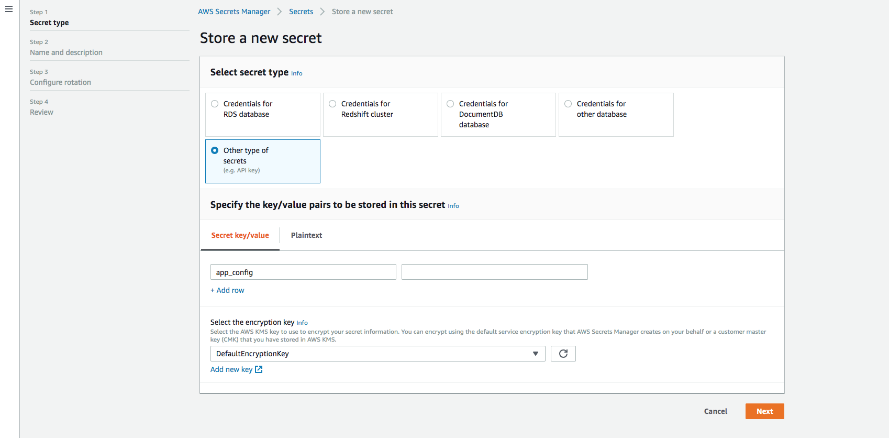
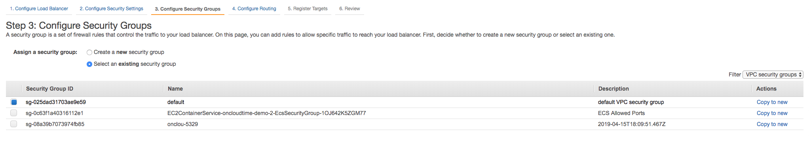

# Application Setup and Installation

## Architecture

OnCloudTime requires  PHP 7.1 and MySQL 5.6 so the recommendation is to run it on the LAMP (Linux Apache MySQL PHP) stack. 

## Server Setup

There are three different ways to setup the application which are covered below:

1. Docker Container Installation on EC2 Instance 
2. Container Installation via ECS
3. Manual installation of all software on an EC2 Instance 

### Pre-requisites

The pre-requisites for the setup are to create the following:

- An ECR repository for the docker images 
- Athena database 
- Aurora database with MySQL 5.6 compatibility 
- SQS Queue 
- SNS Application Topic
- A secret to store the credentials for ECS and access permissions for the ECS roles to read the secret 
- Application Load Balancer with HTTPS 

**NOTE** The recommended region to setup all the services is `us-east-1`

#### Aurora database

Aurora is a pre-provisioned database with MySQL compatibility which removes the need to additional containers running it. The steps to setup are showin in the images below:


#### Amazon Elastic Container Repository

1. Create a new repository 


2. When successfully created it is shown in a list 


3. Clicking the `View push commands` button shows a list of commands that can be used to interact with the repository via the cli
   
   

#### Athena Database

#### SQS Queue

#### SNS Application Topic

#### Secret for Configuration Information

1. Create the secret in which the application configuration will be stored 



2. Set the name of the secret


3. Disable the rotation policy


4. Add privileges to the **ecsInstanceRole** (for EC2 compatibility) and **ecsTaskExecutionRole** (for Fargate compatibility) roles so that it can read the secrets on application startup 


#### Application Load Balancer with HTTPS

The load balancer providers a single point of access for your application via a predefined sub-domain and routes, also providing security negating the need to setup a reverse proxy. 

1. Select the type of load balancer - always select `Application Load Balancer` 
   
    

2. Configure ELB:
   
   * Name `oncloudtime`
   * Scheme `internet-facing` which is accessible from the Internet
   * IP Address type `ipv4` 
   * Listeners - add HTTPS on 443
   * Availability Zones - select a VPC and at least two subnets
     
     

3. Add an existing HTTPS certificate, upload or create a new one via ACM
   
   

4. Add security groups - these must provide access HTTPS ports as specified in Step 2 
   
   

5. Select Security Policy - leave the default `ELBSecurityPolicy-2016-08` 
6. Configure Routing 
   
   * Target group 
     * Select create a new target group with name `tg-elb-oncloudtime-https`
     * Target type `Instance`
     * Protocol `HTTPS`
     * Port `443` 
   * Health Checks 
     * Protocol `HTTP`
     * Path `/monitor/health/`
     
     (this will later be pointed to ECS instances)
     

7. Do not register any targets as these will be added later 
8. Confirmation of successful creation or any errors that may have occured 
   
   

9. Set the target group to have sticky sessions keeping each set of requests to a single instance 
    * On the created ELB select the target group 
    
    * Under attributes, select Stickiness and set the duration to 1 hour (which is equal to the application idle session timeout duration)
    

### Docker on EC2 Instance

1. Create a new EC2 server from Amazon Linux AMI 2018.03.0 (HVM), SSD Volume Type - ami-01e24be29428c15b2
2. SSH into the server using `ssh -i /path/my-key-pair.pem ec2-user@public-dns-hostname`
3. Install docker on the instance: 
   
   ```
   [ec2-user]$ sudo yum update -y
   [ec2-user]$ sudo yum install -y docker
   [ec2-user]$ sudo service docker start
   ```
4. Next, add the `ec2-user` to the `docker` group so you can execute Docker commands without using sudo. Note that you’ll have to log out and log back in for the settings to take effect:
   
   ```
   [ec2-user]$ sudo usermod -a -G docker ec2-user
   [ec2-user]$ exit
   ```
5. To test run `docker info`
6. Download the docker publishing project package by running wget on the provided url for example `https://s3-us-west-2.amazonaws.com/techsoft/oncloudtime/releases/oncloudtime-docker-26_Jan_2019.zip` 
7. Unzip the package by running `unzip oncloudtime-docker.zip` which opens in the current folder 
8. Update the following configurations: 
   * `docker_config_oncloudtime.cnf` 
     - `release_package_path` with the url of the code package
     - `repository_url` the url of the ECR repository to which the application image is deployed
     - `config_url` the ARN of the secret to which the configuration is stored, which is passed as an environment variable to the docker container 
     - `host_port` the host port on which to run the container 
   * `.aws_oncloudtime` - add the AWS access key and secret credentials to enable deployment of the image to ECR 
9. Build the docker images for the application by running `sh docker_build_oncloudtime.sh`
10. Start the application by running `sh docker_run_oncloudtime.sh`
11. Open the application by accessing the public dns name of your EC2 instance `https://public-dns-hostname:host_port`
    
    **NOTES: **

The following scripts are available in the package directory: 

* `docker_bashintocontainer_oncloudtime.sh` - open a bash script into a runging container
* `docker_build_oncloudtime.sh` - builds a docker image using the Dockerfile in the web directory and application code in a url specified by release_package_url in the `docker_config_oncloudtime.cnf` 
* `docker_config_oncloudtime.cnf` - configuration settings file used by all docker containers 
* `docker_pushtoecr_oncloudtime.sh` - build the containers and push to the ECR repository specified by the `repository_url` variable in `docker_config_oncloudtime.cnf` file 
* `docker_remove_oncloudtime.sh` - delete all containers, images and volumes on the server 
* `docker_run_oncloudtime.sh` - run the docker container mapping the image to the port specified by the `host_port` variable in the `docker_config_oncloudtime.cnf` file. The image is deleted once the container is stopped 
* `docker_stop_oncloudtime` - stop a running container 

### ECS Cluster with EC2 Launch Compatibility

This requires the task definition to be with EC2 launch compatibility which allows more control over the instance creation and configuration 

1. Create a new task definition - From Task Definitions in the ECS dashboard, press on the Create new Task Definition (ECS) button
   
   
   
   * Select the launch compatibility type to EC2 - this will not work for ECS Fargate clusters  
     
      
   * Set a task name and use the following steps:
     - Add Container: `oncloudtime` (the one we pushed).
     - Image: the URL to your container pushed to ECR e.g., `168790824676.dkr.ecr.us-east-1.amazonaws.com/oncloudtime` used in the example
     - Soft limit: 768
     - Map 80 (host) to 80 (container) for `oncloudtime` 
   * Environment Variables - this one is very important:
     - CONFIG_URL: e.g., `arn:aws:secretsmanager:us-east-1:168790824676:secret:oncloudtime_config-Wa3muL` - the ARN of the secret in which the application configuration is stored for the cluster. Without this each instance of the application will default to start at the installation screen 

2. Create Cluster to run the application containers run using configurations similar to EC2 instances. 
   
   * Select a cluster template - `EC2 Linux + Networking` 
     
     
   * Define the following:
     * Cluster name: `oncloudtime-cluster`
     * Provisioning Model: On-Demand Instances 
     * EC2 instance type: t2.micro
     * Number of instances: 1
     * EBS storage: 22
     * Key pair: (Select an existing key-pair)
     * VPC: Create a new VPC (you also have an option of selecting an existing VPC but ensure that it has a public subnet). Selecting a new VPC automatically selects to create a new security group 
     * Security group ibound rules - leave the default CDR block with port 80 (for http). This will be updated later to include HTTPS on 443 
     * Container Instance IAM role select `ecsInstanceRole` if available otherwise select to create a new role. **NOTE:** This role will have to be given permission to access the secret for the configuration variable passed to the Task definition 

3. Create a service to run the task definition on the cluster by defining the following:
   
   * Launch type: `EC2`
   * Task definition - select the appropriate revision, the latest is usually the recommended
   * Service Name - use the cluster name then add service for example `oncloudtime-cluster-service`
   * Service type - select Replica 
   * Number of tasks - 1 
   * Deployment - leave default `Rolling Update`
   * Task Placement - leave the default `AZ Balanced Spread`
   * Auto Scaling - select `Do not adjust the service's desired count`


**NOTE:** Once the service is created you may need to wait about 3-4 minutes fo rthe tasks to be created and started. 

### ECS Cluster with Fargate Launch Compatibility

This requires the task definition to be with Fargate launch compatibility which provides more automation for tasks and service management  

1. Create a new task definition - From Task Definitions in the ECS dashboard, press on the Create new Task Definition (ECS) button
   
   
   
   * Select the launch compatibility type to Fargate - this will not work for clusters of launch type EC2
     
      
   * Configure Task and Container Definitions 
     - Task Definition Name `oncloudtime-fargate`
     - Task Role, select `ecsTaskExecutionRole`
     - Task execution IAM Role select `ecsTaskExecutionRole`
     - Task size: 
       * Task memory (GB) select `1GB`
       * Task CPU (vCPU) select `0.5 vCPU`
   * Configure the container   
     - Name: `oncloudtime` (the one we pushed).
     - Image: the URL to your container pushed to ECR e.g., `168790824676.dkr.ecr.us-east-1.amazonaws.com/oncloudtime` used in the example
     - Soft limit: 768
     - Select container port `80` and protocol `tcp`       
   * Environment Variables - this one is very important as this contains the configurations to connect to the different services:
     - Key: `CONFIG_URL`
     - Value: e.g., `arn:aws:secretsmanager:us-east-1:168790824676:secret:oncloudtime_config-Wa3muL` - the ARN of the secret in which the application configuration is stored for the cluster. Without this each instance of the application will default to the installation screen

2. Create Cluster to run the application containers run using configurations similar to EC2 instances. 
   
   * Select a cluster template - `Networking only`
     
     
   
   * Define the following:
     
     * Cluster name: `oncloudtime-fargate-cluster`
     * Networking - do not create a VPC 

3. Select the cluster to display its details 
   
   

4. Create a service to run the task definition on the cluster by defining the following:
   
   * Launch type: `Fargate`
   * Task definition - select the appropriate revision, the latest is usually the recommended
   * Service Name `oncloudtime-fargate-service`
   * Number of tasks - `2`
   * Minimum healthy percent - `100`
   * Maxiumum health percent - `200`
   * Deployment - leave default `Rolling Update`
     
     

5. VPC and Security Groups 
   
   * Cluster VPC - select an existing VPC with public facing subnets 
   * Subnets - select at least 2 subnets from the VPC, the list is automatically provided 
   * Security groups - a default group is selected with access to port 80. Make sure that the security groups have access to the database host (RDS),  
   * Auto-assign public IP - leave default `ENABLED` 

6. Health Check Grace Period - leave unassigned will be updated when ELB is selected 

7. Load Balancing - select None 

8. Leave the defaults for the Service discovery section 

9. Auto Scaling (option) - leave default value `Do not adjust the service's desired count`

10. After review select `Create Service`

## Application Installation

1. Download the application package, unzip it and copy the contents to `/var/www/html/oncloudtime`
2. Run the script `/var/www/html/oncloudtime/deploy.sh` to set the correct permissions for the different directories 
3. Create a database `oncloudtime` and run the initial data script from `/var/www/html/oncloudtime/sql/new_install.sql` 
4. Update the installation configuration file at  `/var/www/html/oncloudtime/config/install.yaml` with the following: 
   * Change the value of `need_update` parameter to `yes` to unlock the installer 
   * Change the value of `rdbms_host` to `localhost` to connect to the local database 
5. Create the following services on AWS: 
   * AWS Key and Secret 
   * Athena database
   * SQS Queue
   * SNS Topic
6. Open the url [http://public-dns-hostname/oncloudtime/install] to start the installer below: 
   * Installation Instructions  
     
     
   * Database Setup for MySQL backend 
     
     
   * S3 configurations 
     
     
   * Athena database configuration 
     
     
   * SQS Queue configuration (_see placeholder for the format_) 
     
     
   * SNS Notification configuration (_see placeholder for the format_)
     
     
   * Successful installation 
     
     
7. Once the installer runs, the wizard is locked to prevent further changes. When accessed the message below is shown: 
   
    

## Post-install Configuration

The post install configurations can be made by ending the config.yaml file in the config folder. The parameter values need to be valid YAML text in double quotes. 

The parameters are named in such a way that they are inutitive 
