## Quick Start Guide for the Nexus Module 
The Nexus module provides the ability to analyse sales transactions based on predefined transaction thresholds.

### Login
1. Enter the provided url in your browser to access the login page
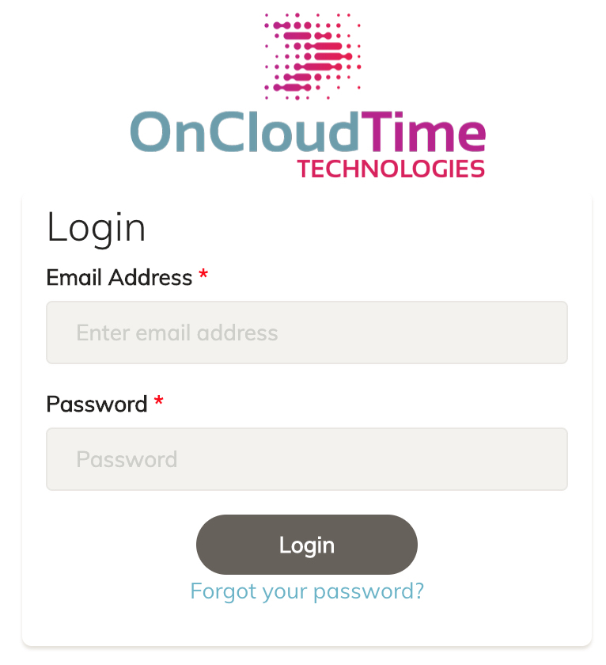{ width=200px }

2. Use the following credentials to login:
   * Email Address: `walmart.user@oncloudtime.com`
   * Password: `12345678`
   
3. Successful login will automatically forward you to the dashboard page which displays a default usage report 
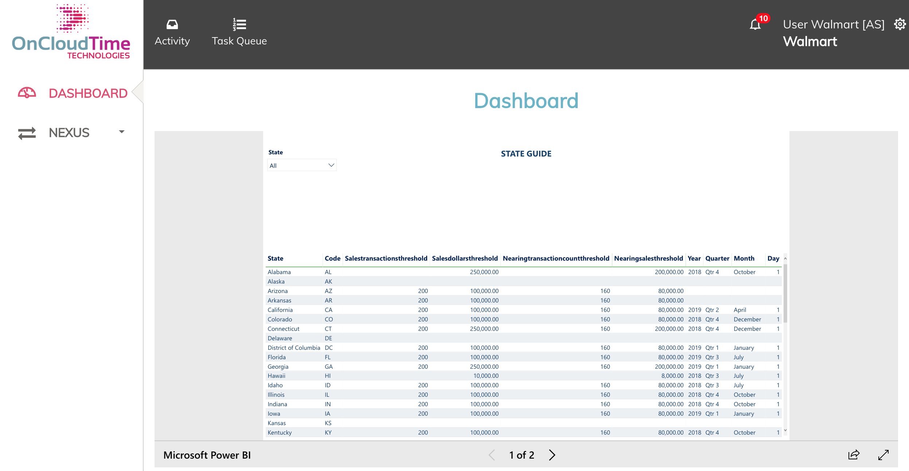

4. Click on the `Nexus` menu item in the left hand side to display the available commands 

\newpage 

### Setup 
1. The setup process creates account specific infrastructure to enable uploading of transaction files for analyis. To start the process click the `Setup` button 
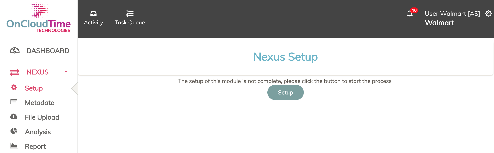

2. When setup is completed a success message is displayed 
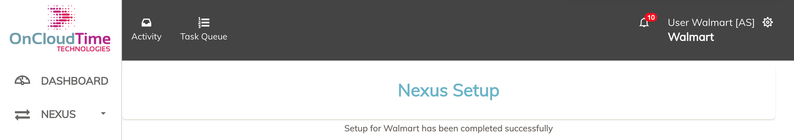

\newpage

### Metadata 
The metadata displays the available thresholds by state 
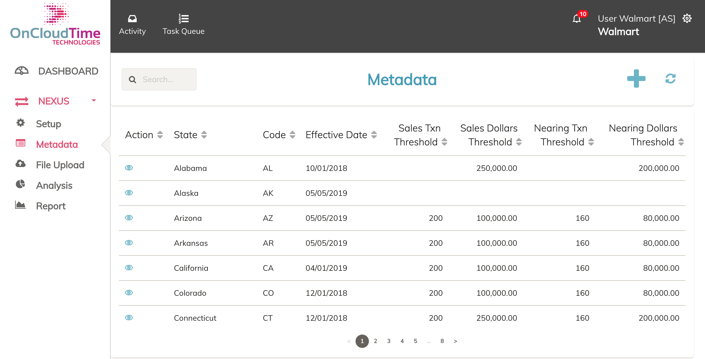

\newpage

### File Upload 
The file upload process allows a user to add data files for analysis, the formats of which are detailed at the end of this section. To upload a file follow the steps below:

1. Click on the `File Upload` link in the left hand menu 
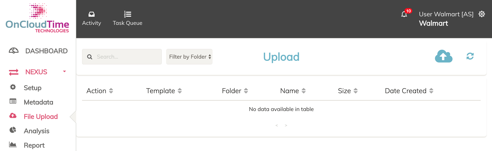

2. Select the file to upload and the template, currently only the default `Nexus` is selectable 
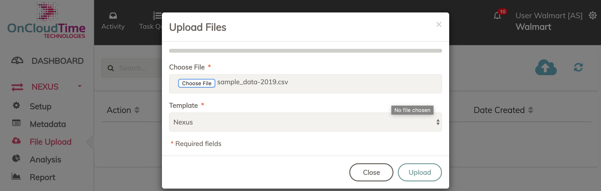

3. When the file upload is completed the file is displayed in a list as below 
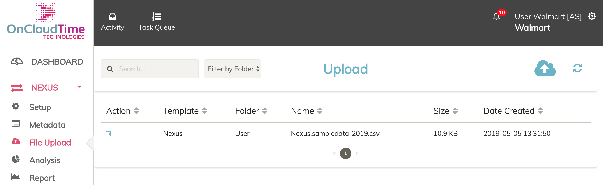

### File Upload Format 
The formats of the data file to be uploaded have to adhere to the format provided otherwise the analysis will not be successful. The format requirements are:

1. File Format: CSV or Excel Files 

2. Data fields:
   - State: Full Name (code and mixed formats will be supported later)
   - Sales Price: number with no currency signs 
   - Document Number: String 
   - Document Date with format 04/17/2018 
   - Posting Date withformat 04/17/2018 

3. A sample of the data is displayed below 
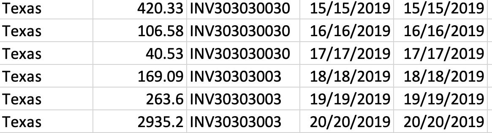

\newpage

### Analysis
Once the file uploads are completed, the analysis step begins. Click the `Analysis` link on the left hand menu. 

1. By default the dates selected are the earliest and latest dates in the currently uploaded data files to help choose date ranges 
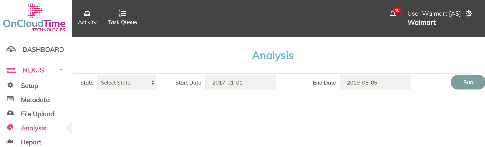

2. Clicking the `Run` will run the analysis across all the states and the provided dates. At the bottom of the results is a link to download the results of the analysis in CSV format 
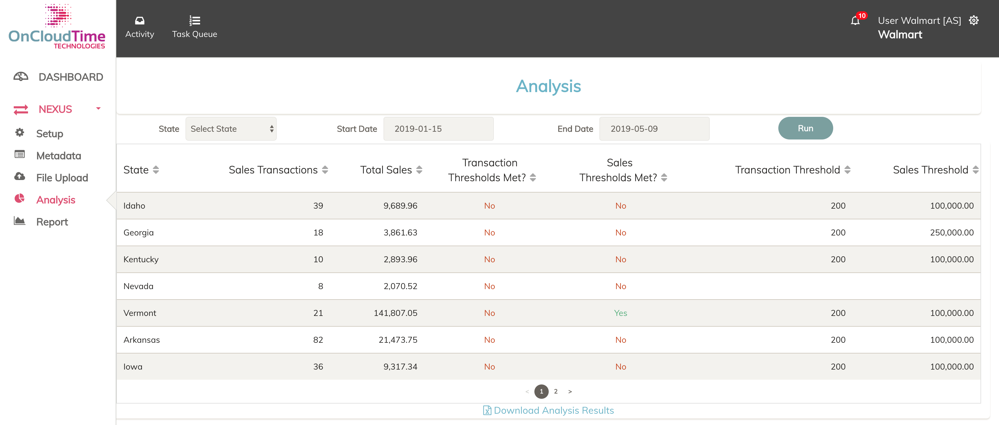

3. A user can decide to analyse by a single state or even change the dates of the analysis 

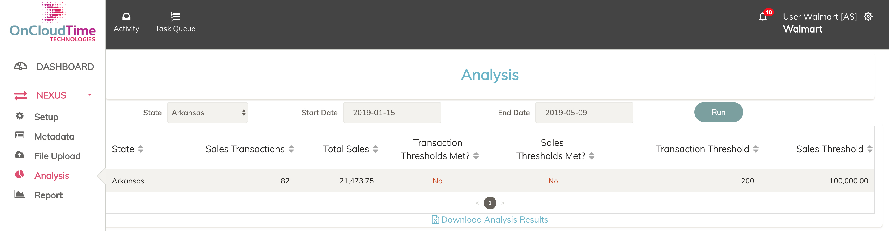